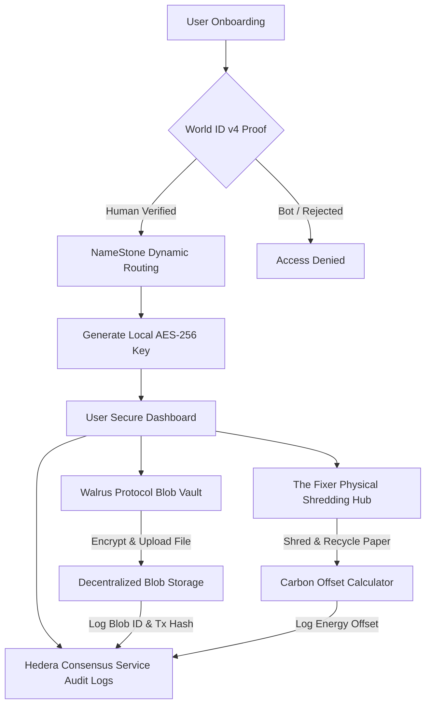

# Satoshi's ParaBox

> *"It matters not if Satoshi existed, but instead that which the potential of the existence or destruction of his data represents."*

Satoshi's ParaBox is a high-security, decentralized data vault and privacy dashboard. It integrates several leading web3 protocols to enable secure identity verification, client-side encrypted file storage, gasless workspace routing, and compliance logging—all under a carbon-negative environmental offset model.

---

## 🏛️ System Architecture



---

## 🛠️ Technology Stack & Integrations

1. **World ID (v4)**: Verifies unique humanity via zero-knowledge proofs (ZKP) to unlock access to the secure dashboard without disclosing personal identity.
2. **ENS Subdomains (NameStone)**: Dynamically registers gasless subdomains (e.g., `human_1c3fa8.satoshisparabox.eth`) to assign isolated, routing-based user workspaces without database logging.
3. **Walrus Protocol**: Handles client-side encrypted decentralized file storage. Vault uploads are split and distributed across storage nodes using local AES keys.
4. **Hedera Consensus Service (HCS)**: Maintains an immutable, HIPAA-grade audit feed of all platform operations (identity registration, blob uploads, session lockouts, file purging, physical offsets). *No Solidity or complex EVM state required.*
5. **Auto-Lockout**: Implements client-side TTL key deletion that wipes active keys and logs lockout states on-chain when the inactivity timer expires.
6. **"The Fixer" & Environmental Offsets**: A physical representative hub to coordinate physical paper collection, secure shredding, and paper recycling, converting carbon reduction credits into operational offset parameters.

---

## 📂 Repository Structure

* [web/](file:///C:/Users/jmuni/.gemini/antigravity/scratch/Satoshi-ParaBox/web): The Next.js web application built with React, TypeScript, and dynamic web3 integrations.
* `Terminal Code - Nancy`: Historical terminal log documenting the initial workspace setup steps.
* `gemini conv 1`: Conversation transcripts outlining the architectural definitions of the project.
* `handwritten notes - starting point.jpg`: Original spec notes image describing the features and philosophical baseline of the project.

---

## 🚀 Getting Started

### Prerequisites
Make sure you have Node.js and npm installed on your system.

### Installation
1. Clone the repository (if you haven't already):
   ```bash
   git clone https://github.com/Butterfliesinspacejoe/Satoshi-ParaBox.git
   cd Satoshi-ParaBox
   ```
2. Navigate to the web application directory and install dependencies:
   ```bash
   cd web
   npm install
   ```

### Running Locally
To launch the development server on `http://localhost:3000`:
```bash
npm run dev
```

### Building for Production
To compile and typecheck the production build:
```bash
npm run build
```

---

## 🔒 Security Policy
All cryptographic keys (such as AES vault keys) are generated locally inside your browser memory and are **never** transmitted to any server or protocol aggregator. When the auto-lockout TTL timer expires, these keys are destroyed in client memory, requiring re-verification via World ID to decrypt your dashboard.
